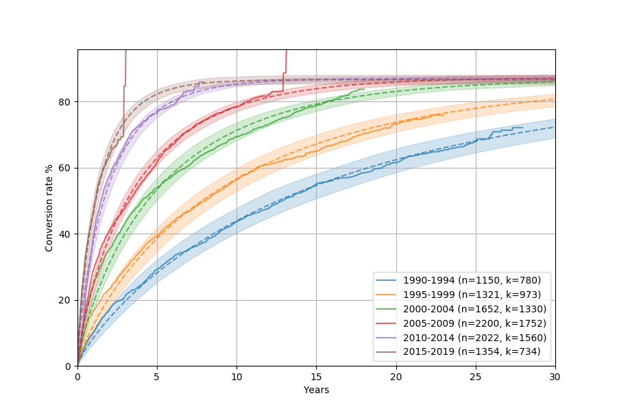

[](https://travis-ci.org/better/convoys)
[](https://coveralls.io/github/better/convoys?branch=master)
[](https://pypi.org/project/convoys/)

Convoys
=======



Convoys is a simple library that fits a few statistical model useful for modeling time-lagged conversions.
There is a lot more info if you head over to the  [documentation](https://better.engineering/convoys/).
You can also take a look at [this blog post](https://better.engineering/2019/07/29/modeling-conversion-rates-and-saving-millions-of-dollars-using-kaplan-meier-and-gamma-distributions/) about Convoys.

Installation
------------

The easiest way right now is to install the latest version from PyPI:

```
pip install convoys
```

More info
---------

Convoys was built by [Erik Bernhardsson](https://github.com/erikbern) and has the MIT license.
