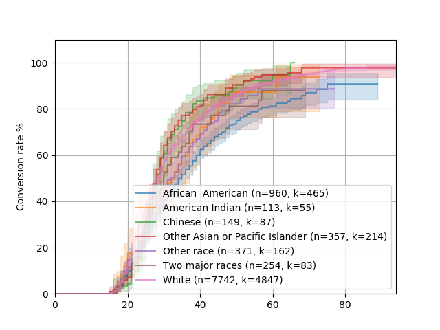
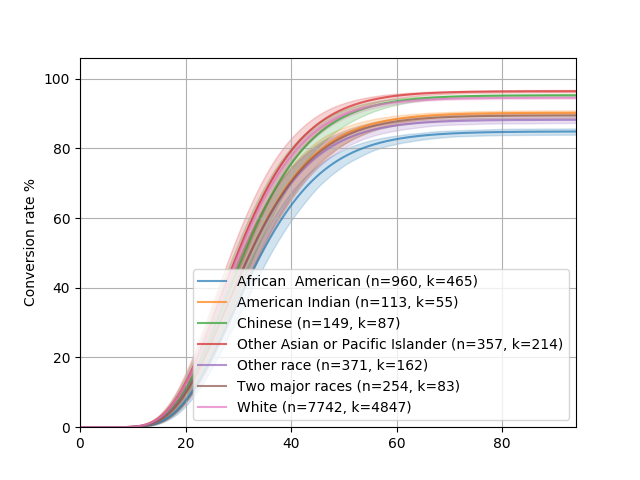
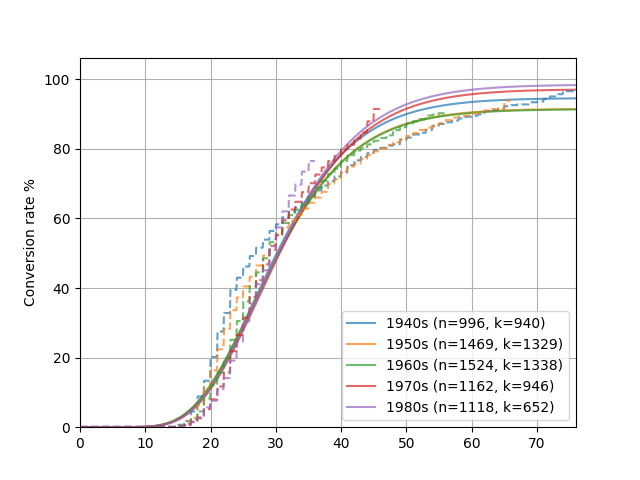

The main use case for something like Convoys is definitely for online advertising, ecommerce, or similar applications.
However, there are several places these models can be useful, which we will illustrate with some very different types of datasets.

Example 1: NY Department of Buildings violations
------------------------------------------------

Example 2: Age of marriage
--------------------------

This example looks at time until marriage.
Since not everyone marries, it's a great example where `survival analysis <https://en.wikipedia.org/wiki/Survival_analysis>`_ would not be correct
(although *most* people marry, so the difference isn't that huge).

There's a dataset in the repo that contains year born, year married, and a number of attributes for a random sample of a few hundred thousand Americans.
The data is included as a Pandas dataframe.
Let's load it up!

.. code-block:: python

    f = open('examples/marriage.pickle', 'rb')
    df = pickle.load(f)
    df = df.sample(n=10000)  # Subsample to make it faster

The next step is to convert it to numpy arrays so that we can work with it.
Convoys comes with a utility function :func:`convoys.utils.get_arrays` that handles the conversion for you:

.. code-block:: python

    _, groups, (G, B, T) = convoys.utils.get_arrays(
        df, groups='race', created='born', converted='married', group_min_size=100)

This will create three numpy arrays that we can use to plot.
Let's start with a nonparametric Kaplan-Meier estimator:

.. code-block:: python

    convoys.plotting.plot_cohorts(G, B, T, model='kaplan-meier', ci=0.95, groups=groups)
    pyplot.legend()
    pyplot.show()

This should show something similar to this:

Now, let's plot a generalized Gamma distribution:

.. code-block:: python

    convoys.plotting.plot_cohorts(G, B, T, model='generalized-gamma', ci=0.95, groups=groups)
    pyplot.legend()
    pyplot.show()

This should show something similar to this:

As you can see, the generalized Gamma distribution fits the nonparametric plot fairly well.
It's not entirely perfect though, and it depends on the dataset.
Certain datasets around conversion rates tend to fit the models very well.
Marriages may be generated by some more complicated model.

One of the benefits of parametric models is that you can extrapolate them to see the final conversion rate.
Let's try to fit generalized Gamma models to marriage rates by birth cohorts:

.. code-block:: python

    df = df[(1940 <= df['born']) & (df['born'] < 1990)]
    df['decade'] = df['born'].apply(lambda year: '%ds' % (10*(year//10)))
    _, groups, (G, B, T) = convoys.utils.get_arrays(
        df, groups='decade', created='born', converted='married')
    convoys.plotting.plot_cohorts(G, B, T, model='generalized-gamma', groups=groups)
    pyplot.legend()
    convoys.plotting.plot_cohorts(G, B, T, model='kaplan-meier', groups=groups, plot_args={'linestyle': '--'})
    pyplot.show()

This will generate something like this:

