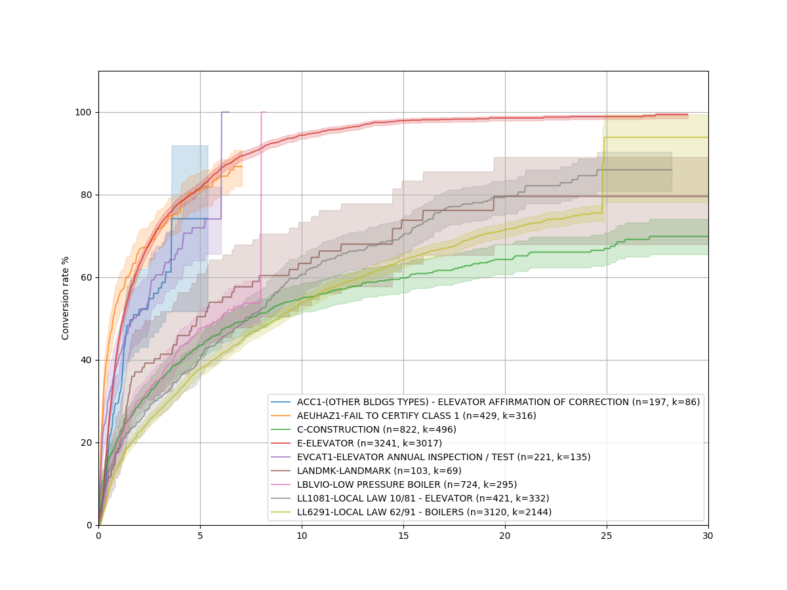
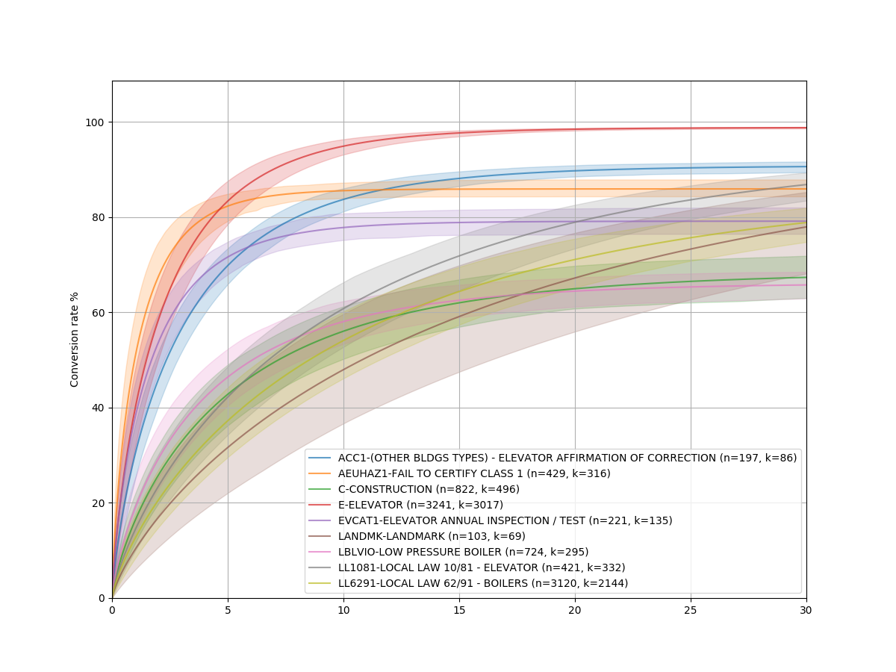
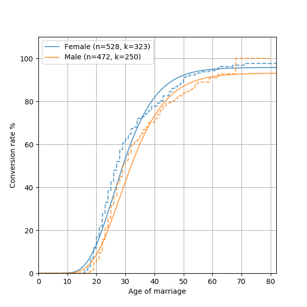

The main use case for something like Convoys is definitely for online advertising, ecommerce, or similar applications.
However, there are several places these models can be useful, which we will illustrate with some very different types of datasets.

Example 1: NYC Department of Buildings violations
-------------------------------------------------

We are going to look at complaints received by the Department of Buildings in NYC.
The dataset is `available here <https://data.cityofnewyork.us/Housing-Development/DOB-Complaints-Received/eabe-havv>`_.

First, lets load it. There is a `pandas <https://pandas.pydata.org/>`_ DataFrame in the examples/ directory that contains a subsampl of the full dataset (10,000 rows out of the 1.3M rows).

.. code-block:: python

    df = pandas.read_pickle('examples/dob_violations.pickle')

We are going to look at time delay from issue to disposition (when the case was finally resolved, or closed).
The next step is to convert it to numpy arrays so that we can work with it.
Convoys comes with a utility function :func:`convoys.utils.get_arrays` that handles the conversion for you.
Several of the arguments are references to columns in the dataframe, in this case *type*, *issue_date*, and *disposition_date*.

.. code-block:: python

    unit, groups, (G, B, T) = convoys.utils.get_arrays(
        df, groups='type', created='issue_date', converted='disposition_date',
        unit='Years', group_min_size=100)

This will create three numpy arrays that we can use to plot.
Let's start with a nonparametric :class:`Kaplan-Meier <convoys.single.KaplanMeier>` estimator and plot it using the :func:`convoys.plotting.plot_cohorts` function.

.. code-block:: python

    convoys.plotting.plot_cohorts(G, B, T, model='kaplan-meier', ci=0.95, groups=groups)
    pyplot.legend()
    pyplot.show()

This should show something similar to this:

The fact that some complaints take 30 years to resolve is pretty baffling.
I have no idea why it's so bad!

Anyway, let's fit a :class:`Weibull <convoys.regression.Weibull>` distribution.
This is a *parametric* model, meaning it will fit a mathematical model with a few unknowns by finding the values of those unknowns that optimizes the fit.

.. code-block:: python

    convoys.plotting.plot_cohorts(G, B, T, model='weibull', ci=0.95, groups=groups)
    pyplot.legend()
    pyplot.show()

This should show something similar to this:

As you can see, the Weibull distribution fits the nonparametric plot fairly well!

One of the benefits of parametric models is that you can extrapolate them to see the final conversion rate.
Let's try to fit the Weibull model to see how different cohorts of reported violations are cleared.
Let's also plot the Kaplan-Meier and the Weibull model on top of each other so that we can compare visually how well the model fits.

.. code-block:: python

    df['bucket'] = df['issue_date'].apply(lambda d: '%d-%d' % (5*(d.year//5), 5*(d.year//5)+4))
    unit, groups, (G, B, T) = convoys.utils.get_arrays(
        df, groups='bucket', created='issue_date', converted='disposition_date',
        unit='Years', group_min_size=500)
    convoys.plotting.plot_cohorts(G, B, T, model='kaplan-meier', groups=groups, t_max=30)
    convoys.plotting.plot_cohorts(G, B, T, model='weibull', groups=groups, t_max=30, plot_args={'linestyle': '--'}, ci=0.95)
    pyplot.legend()
    pyplot.show()

This will show something like this:

.. image:: images/dob-violations-combined.png

The dashed lines are the Kaplan-Meier curves, whereas the solid ones with the shaded area are the Weibull model (with corresponding uncertainty intervals).
They match really well!

It looks like disposition has gotten consistently faster over the years, which is good to see.
The weird vertical jumps in Kaplan-Meier is just an artifact of how the model is fit, where the last observation ends up being drawn in a funny way.

Example 2: Age of marriage
--------------------------

This example looks at time until marriage.
Since not everyone marries, it's a great example where `survival analysis <https://en.wikipedia.org/wiki/Survival_analysis>`_ would not be correct
(although *most* people marry, so the difference isn't that huge).

There's a dataset in the repo that contains year born, year married, and a number of attributes for a random sample of a few hundred thousand Americans.
The data is included as a Pandas dataframe.

Let's fit a :class:`generalized Gamma distribution <convoys.regression.GeneralizedGamma>`!
Why that distribution?
Unlike the previous example, we expect some kind of time lag before the first conversion even start to happen.
A Gamma distribution is a sum of *k* exponentials, which can be interpreted as various life phases a person goes through (newborn, toddler, etc).

A *generalized* Gamma distribution adds another paramter *p* which makes each exponential into a Weibull.
This just gives one more degree of freedom to fit the model.

.. code-block:: python

    df = pandas.read_pickle('examples/marriage.pickle')
    _, groups, (G, B, T) = convoys.utils.get_arrays(
        df, groups='sex', created='born', converted='married')

    pyplot.figure(figsize=(12, 9))
    convoys.plotting.plot_cohorts(G, B, T, model='generalized-gamma', groups=groups)
    pyplot.legend()
    convoys.plotting.plot_cohorts(G, B, T, model='kaplan-meier', groups=groups, plot_args={'linestyle': '--'})
    pyplot.savefig('marriage-combined.png')

This will generate something like this:

As you can see, marriage data does not quite follow a generalized Gamma distribution.
This is not quite shocking, since many complex real world phenomenon are not always possible to model mathematically.
Some resources `suggest <http://data.princeton.edu/pop509/ParametricSurvival.pdf>`_ fitting a "Coale-McNeil" model to this instead, which seems like an interesting future addition to Convoys.
