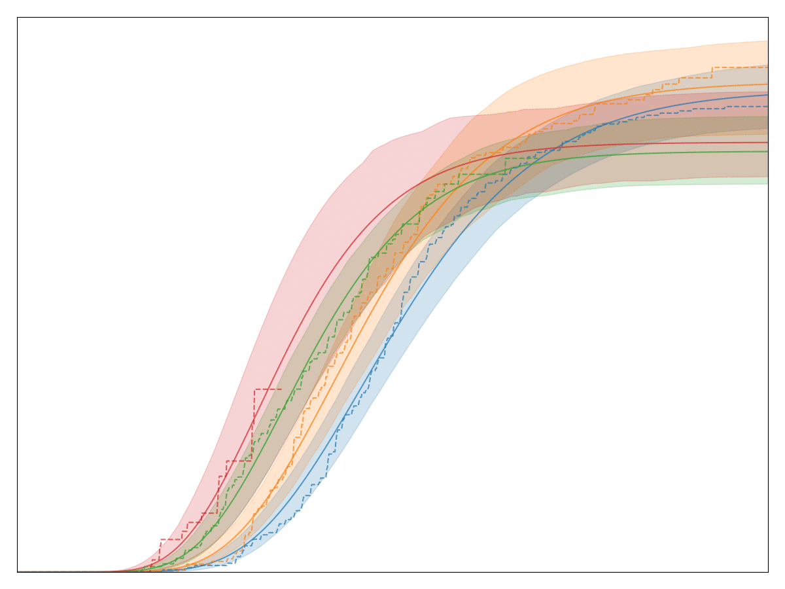

Motivation
==========

A perfectly valid question is: Convoys really only implements one model: a generalized Gamma distribution multiplied by basically logistic regression. That seems like a very specialized distribution. In order to justify this choice, let's first look at a handful of conversion charts from real data at `Better <https://better.com>`_:

The legend, labels of the axes, and title are all removed so that no business secrets are revealed. The solid lines with shaded area are all the generalized Gamma fits, whereas the dashed lines are the Kaplan-Meier fits. Note that the fit is very good! In fact, we have observed that almost any conversion metric can be modeled reasonably well with the generalized Gamma model (multiplied by logistic regression).

Empirically, this model seems to hold up pretty well.

Some more mathematical justification
------------------------------------

A simple toy problem also demonstrates why we would expect to get a time-dependent distribution (like the Exponential distribution) multiplied by a logistic function. Consider the `continuous-time Markov chain <https://en.wikipedia.org/wiki/Markov_chain#Continuous-time_Markov_chain>`_ with three states: undecided, converted, or died.

.. image:: images/convoys-markov-chain.png
   :height: 300px
   :width: 300px

Everyone starts out "undecided" but either converts or dies. However, we *only observe the conversions,* not the deaths.

We can solve for the distribution by thinking of this as a partial differential equation. The solution turns out to be quite simple:

.. math::
   P_{\mbox{converted}}(t) = \frac{\lambda_1}{\lambda_1 + \lambda_2}(1 - \exp(-(\lambda_1 + \lambda_2)t))

As you can see, the solution is an exponential distribution (the :math:`1 - \exp(-(\lambda_1 + \lambda_2)t)` part) multiplied by a constant factor (the :math:`\lambda_1/(\lambda_1 + \lambda_2)` part).

Turning it into a regression problem
------------------------------------

Note that :math:`\lambda_1` and :math:`\lambda_2` are positive numbers. For each observation :math:`z`, let's write it as a linear combination :math:`\lambda_1 = \exp(a^Tz)` and :math:`\lambda_2 = \exp(b^Tz)` where :math:`a, b` are two unknown vectors.

With this transformation, the probability of conversion becomes

.. math::
   P_{\mbox{converted \rightarrow \infty}}(t) = \frac{1}{1 + \exp(-(a-b)^Tz)}

This is the `sigmoid function <https://en.wikipedia.org/wiki/Sigmoid_function>`_ which means that we are doing logistic regression in the limit where :math:`t \rightarrow \infty`.
