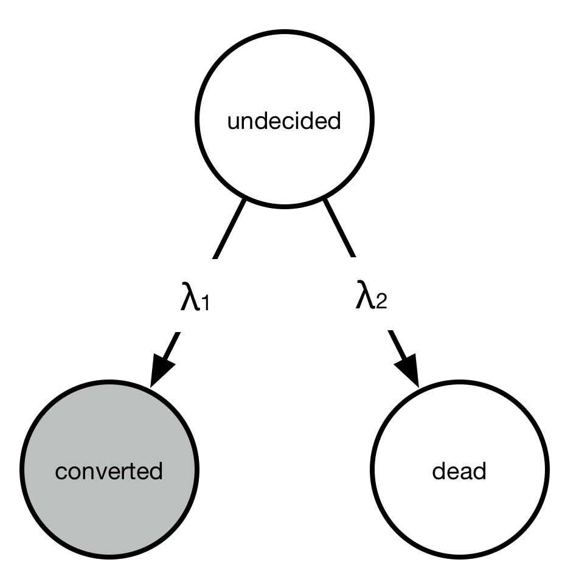
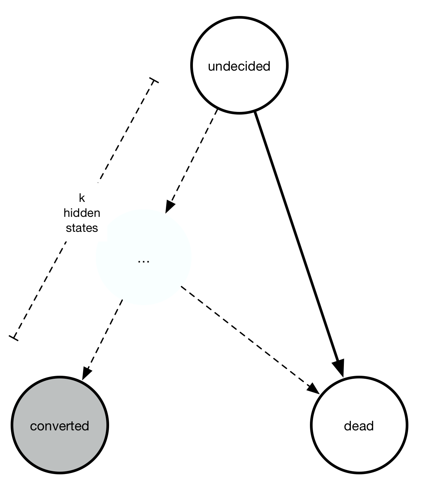
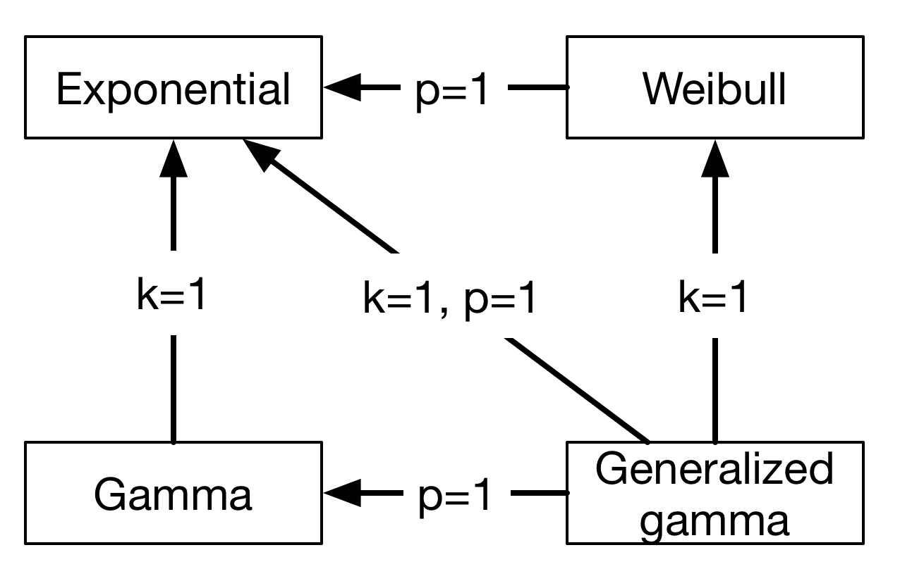

Motivation
==========

A perfectly valid question is: Convoys really only implements one model: a generalized Gamma distribution multiplied by basically logistic regression. That seems like a very specialized distribution. In order to justify this choice, let's first look at a handful of conversion charts from real data at `Better <https://better.com>`_:

.. image:: images/conversion.gif
   :align: center

The legend, labels of the axes, and title are all removed so that no business secrets are revealed. The solid lines with shaded area are all the generalized Gamma fits, whereas the dashed lines are the Kaplan-Meier fits. Note that the fit is very good! In fact, we have observed that almost any conversion metric can be modeled reasonably well with the generalized Gamma model (multiplied by logistic regression).

Empirically, this model seems to hold up pretty well.

Some more mathematical justification
------------------------------------

A simple toy problem also demonstrates why we would expect to get a time-dependent distribution (like the Exponential distribution) multiplied by a logistic function. Consider the `continuous-time Markov chain <https://en.wikipedia.org/wiki/Markov_chain#Continuous-time_Markov_chain>`_ with three states: undecided, converted, or died.

Everyone starts out "undecided" but either converts or dies with rates :math:`\lambda_1` and :math:`\lambda_2`. However, we *only observe the conversions,* not the deaths. We can solve for the distribution by thinking of this as a partial differential equation:

.. math::
   \frac{\partial P_{\text{converted}}(t)}{\partial t} = \lambda_1 P_{\text{undecided}}(t) \\
   \frac{\partial P_{\text{dead}}(t)}{\partial t} = \lambda_2 P_{\text{undecided}}(t)

The solution turns out to be quite simple:

.. math::
   P_{\text{converted}}(t) = \frac{\lambda_1}{\lambda_1 + \lambda_2}\left(1 - \exp(-(\lambda_1 + \lambda_2)t)\right)

As you can see, the solution is an exponential distribution (the :math:`1 - \exp(-(\lambda_1 + \lambda_2)t)` part) multiplied by a constant factor (the :math:`\lambda_1/(\lambda_1 + \lambda_2)` part).

Turning it into a regression problem
------------------------------------

Note that :math:`\lambda_1` and :math:`\lambda_2` are positive numbers. For each observation :math:`z`, let's set :math:`\lambda_1 = \exp(a^Tz)` and :math:`\lambda_2 = \exp(b^Tz)` where :math:`a, b` are two unknown vectors.

With this transformation, the probability of conversion becomes

.. math::
   P_{\text{converted}}(t \rightarrow \infty) = \frac{1}{1 + \exp(-(a-b)^Tz)}

This is the `sigmoid function <https://en.wikipedia.org/wiki/Sigmoid_function>`_. If you set :math:`\beta = a - b` then it turns into ordinary logistic regression where :math:`\beta` is the unknown feature weights that we are trying to learn. This shows that the regression method in convoys turns into logistic regression in the limit where :math:`t \rightarrow \infty`.

Weibull, gamma, and generalized gamma distributions
---------------------------------------------------

Moving on from exponential distributions, there are some good reasons we would want a bit more flexibility with the conversion rates. The `Weibull distribution <https://en.wikipedia.org/wiki/Weibull_distribution>`_ adds one single parameter and is widely used in time-to-event analysis. Empirically, the Weibull model seems to fit a large range of applications, where the common pattern is that conversions start immediately at :math:`t=0`.

Another class of processes model the behavior where there might be some internal states between "undecided" and "converted" that causes conversions not to start immediately. The sum of multiple exponential distributions is a `gamma distribution <https://en.wikipedia.org/wiki/Gamma_distribution>`_. It also requires one more parameter than the exponential distribution.

Finally, the generalized gamma distribution unifies the Weibull and the gamma distribution, and requires two more parameters than the exponential distribution. The relationship between all four distributions can be summarized in this chart:

